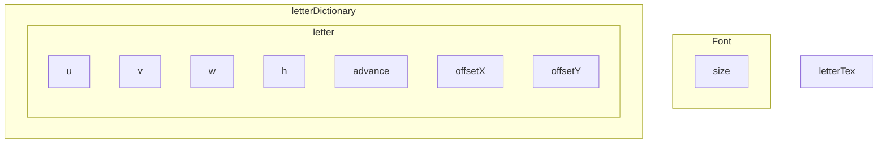

# v1
  
- [x] Right-Handed Coordinate 
- [x] $p = proj * view * model * \bar{p} $
$$\left[ \begin{matrix}
   x \\
   y \\
   z \\
   1 
  \end{matrix}
  \right] = \left[
 \begin{matrix}
   1 & 0 & 0 & t_x \\
   0 & 1 & 0 & t_y \\
   0 & 0 & 1 & t_z \\
   0 & 0 & 0 & 1
  \end{matrix}
  \right] \left[
 \begin{matrix}
   \bar{x} \\
   \bar{y} \\
   \bar{z} \\
   1
  \end{matrix}
  \right]$$

- [ ] Desgin (provisional)
```mermaid
graph TB
    subgraph Graphics
    Device
    Mesh
    Shader
    Texture
    end
    
    subgraph Node
      Position
      Rotation
      Scale
      Parent
      Children
      subgraph Component
        awake
        update
        onDestroy
      end
    end

    subgraph Scene
      updatePhase
    end
    subgraph Managers
      TimeManager
      InputManager
      CameraManager
      RenderManager
      ResourceManager
      LightManager
      InputManager
      TimeManager
      ObjectManager
    end

    Scene-->Node
    Scene.->Managers

    Prefab
    Prefab-->Node

    Light
    Camera
    Render
    Render.->Shader
    Render.->Texture
    Render.->Mesh
    Render.->Light
    Component---Camera
    Component---Render
    Component---Light
    Device-->Mesh
    Device-->Shader
    Device-->Texture
```
- [ ] Font

- [ ] ManagerContext
- [ ] CopyObject
- [ ] ReadWrite
- [ ] Network
- [ ] Animator Animation
- [ ] Tween
- [ ] UI

- [ ] Event
- [ ] Script
- [ ] Logger